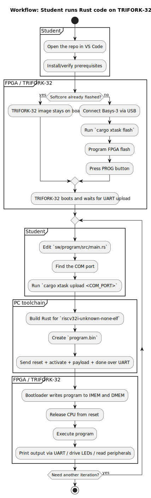
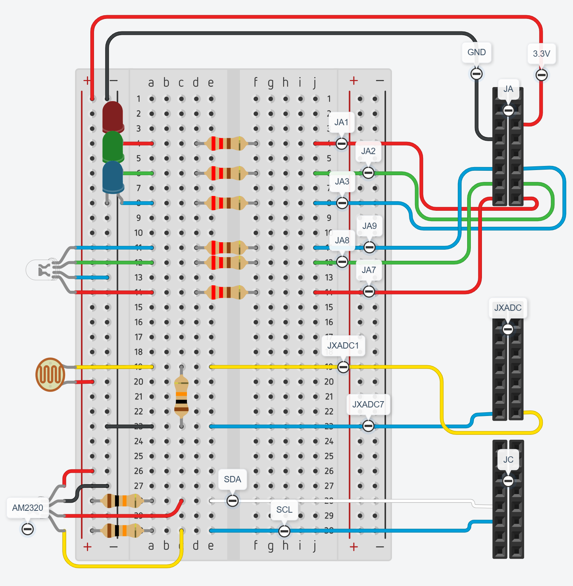

# Manual: TRIFORK-32 - RISC-V MCU for embedded systems programming 02112 at DTU
## Introduktion - hvad systemet er og kan
TRIFORK-32 er en MCU (Microcontroller Unit) som ved hjælp af implementeringen af en softcore (Wildcat) 3-trins pipelinet RISC-V processor på et Digilent Basys 3 Artix-7 FPGA, muliggør programmering af selvsamme processor og tilhørende periferienheder i Rust. 
Periferienheder som LED, knapper, UART, analog input (ADC), I2C og de bidirektionelle PMOD-porte (JA/JB/JC) interageres med via prædefineret Memory-Mapped I/O. For at forenkle systemet er der udviklet et tilhørende abstraktionslag til føromtalte Memory-Mapped I/O, som leverer færdigbagte hjælpefunktioner der forenkler programmeringen af selvsamme.


Med denne MCU kan du styre LEDs, aflæse knapper, dæmpe outputs med PWM (f.eks. en RGB-LED), aflæse analoge signaler via ADC, kommunikere med eksterne sensorer over I2C, samt sende og modtage data over seriel kommunikation (UART) - alt sammen fra Rust-programmer du selv skriver og uploader til boardet.

Denne manual guider dig igennem opsætning af systemet, forklarer den underliggende arkitektur, og giver dig en komplet reference over de tilgængelige hjælpefunktioner med tilhørende eksempler.

## Begreber og Terminologi **(Anbefalet læsning inden næste sektion)**
### Hvad er en softcore
En normal processor er en fysisk siliciumchip hvor uforanderlige transistorer udgør processorens interne logik. En "softcore" er en processor der er beskrevet i kode og derefter flashet over på en FPGA. FPGA'en bruger konfigurerbare logikblokke, som så kan implementere den logik som koden for softcoren beskriver, og dermed opfører sig som en rigtig processor. Derfor skal man først flashe softcoren som projektet beskriver - det konfigurerer FPGA'en til at være en (for dette projekt's specifikke softcore) Wildcat-processor.

### Hvad er GPIO (General Purpose Input/Output)
GPIO refererer til de fysiske pins på boardet der kan bruges til at sende eller modtage elektriske signaler. En LED tilsluttet en GPIO-pin kan eksempelvis tændes og slukkes af software, eller en knaps input kan aflæses. "General Purpose" betyder at disse pins ikke er funktionsspecifikke, men derimod kan bruges til hvad end du kobler på dem.

### Hvad er PMOD GPIO
PMOD-porte på denne SoC er delt op i tre 8-bit GPIO-banker: JA, JB og JC. Hver bank har fem registre:
- `DIR` til at vælge retning for hver pin
- `OUT` til at skrive output-værdier
- `IN` til at læse de aktuelle pin-niveauer
- `PWM_EN` til at route PWM-signalet til specifikke pins
- `IN_DEBOUNCED` til at læse stabile knap-inputs uden bounce

Det betyder at du både kan styre almindelige digitale signaler og bruge de samme porte til dæmpede outputs, f.eks. en RGB-LED på PMOD-headeren.

### Hvad er Memory-Mapped I/O (MMIO)
RISC-V arkitekturen som Wildcat-processoren er bygget på har kun load/store operationer til at kommunikere med hvad end der eksisterer uden for CPU'en selv. Derfor bruges memory-mapping til at kortlægge specifikke I/O-enheder til specifikke hukommelsesadresser. Når processoren under kørsel af et program skal interagere med forskellige I/O, laver den enten en read eller write operation på en af de specifikke hukommelsesadresser som den specifikke I/O korresponderer med. SoC'en har logik der forstår at for disse specifikke adresser skal den udføre instruktionerne på I/O-enhederne og ikke i den rigtige hukommelse - eksempelvis LED-registret.

### Hvad er HAL (Hardware Abstraction Layer)
For at forenkle programmering af denne MCU er selveste interaktionen med det tilgængelige Memory-Mapped I/O løftet op på et højere abstraktionsniveau. I stedet for at skulle kende de specifikke hukommelsesadresser, er dette et lag af hjælpefunktioner hvor adresserne er hardcodet sammen med den ønskede interaktion i specifikke funktioner. I stedet for at skrive `unsafe { (0xF010_0000 as *mut u32).write_volatile(0xFF) }` kan man skrive `leds::write(0xFF)`.

### Hvad er PWM (Pulse Width Modulation)
PWM er en teknik til at styre hvor meget effekt der leveres til en enhed - f.eks. lysstyrken af en LED - ved at tænde og slukke signalet ekstremt hurtigt. I stedet for at sende en "halv" spænding (hvilket kræver analog elektronik), tænder vi LED'en i en vis procentdel af tiden og slukker den resten. Dette forhold kaldes *duty cycle*: 100% = altid tændt (fuld lysstyrke), 50% = tændt halvdelen af tiden (halv lysstyrke), 0% = altid slukket.

Når skiftene sker hurtigt nok (typisk over 100Hz), kan det menneskelige øje ikke skelne de individuelle blink - det opfattes som en jævn dæmpet lysstyrke. På denne SoC kører PWM-tælleren med ~390 kHz, langt over flimre-grænsen, så alle dæmpede LEDs producerer den ønskede bløde og glatte effekt.

PWM-modulet i denne SoC er implementeret direkte i hardware. Det betyder at CPU'en kun skal skrive én duty cycle-værdi per kanal, og så generere hardwaren selv de hurtige skift. CPU'en er demed fri til at lave andet arbejde imens.

### Hvad er en RGB-LED
En RGB-LED er tre separate enkeltfarvede LEDs (rød, grøn, blå) pakket ind i én fysisk komponent. Ved at styre lysstyrken af hver af de tre kanaler uafhængigt - typisk via PWM - kan man vlande farverne og proiducere næsten enhver farve. Denne farveblanding sker i dit øje, ikke i LED'en: når tre lyskilder sidder tæt nok sammen, kan øjet ikke skelne dem individuelt og opdatter dem som ét kombineret lys.

RGB-LEDs findes i to varianter: *common-anode* hvor den fælles pin er +3.3V og hver farvekanal tændes ved at trække den til ground, og *common-cathode* hvor det er omvendt. I common-anode betyder det at en *lav* duty cycle giver *høj* lysstyrke — hvilket HAL-funktionen `rgb::set` tager højde for automatisk.

### Hvad er ADC (Analog-til-Digital Converter)
De fleste signaler en processer arbejder med er digitale - enten højt (1) eller lavt (0). Men mange sensorer, f.eks. potentiometre og lyssensorer, leverer et *analogt* signal: en spænding der glider jævnt mellem 0 V og en referencespænding. En ADC oversætter denne kontinuerlige spænding til heltal, som CPU'en kan læse.

På denne SoC bruger ADC'en FPGA'ens indbyggede XADC og er forbundet til JXADC-headeren. Den har fire kanaler (indeks 0-3) og leverer en 12-bit værdi: et heltal mellem 0 og 4095, hvor 0 svarer til den laveste spænding og 4095 til den højeste. En måling på halvdelen af referencespænndingen giver altså omkring 2048.

### Hvad er I2C (Inter-Integrated Circuit)
I2C er en seriel databus der lader processoren kommunikere med eksterne enheder - typisk sensorer - over kun to ledninger: **SDA** (data) og **SCL** (clock), som alle enheder på bussen deler.

Hver enhed har en 7-bit adresse. Processoren er **master**: den starter hver overførsel, sender adressen på den enhed den vil tale med, og enheden svarer med enten ACK (bekræftelse) eller NACK (intet svar). Derefter overføres data én byte ad gangen. På denne SOC sidder I2C-controlleren på PMOD JC, hvor `JC[2]` er SDA og `JC[3]` er SCL; selve hjælpefunktionerne beskrives i HAL-referencens I2C-afsnit.

## Forudsætninger og opsætning
Forudsætningerne for at og flashe projektets softcore arkitektur over på en Basys 3 FPGA for tilsidst at uploade og køre det Rust program der udgør logikken for dit miljø-overvågningssystem er beskrevet i den installationsguide du finder i projektetes `README.md`-fil. 



Herunder en forklaring af hvad hver værktøj bruges til.

### **Forudsætninger:** Værktøjer der skal være installeret
| Værktøj | Formål |
|---|---|
| Vivado | Er Xilinx' udviklingsmiljø til FPGA'er. Det tager SoC-designets hardwarebeskrivelse (genereret Verilog-kode), syntetiserer det ned til en bitstream, og flasher bitstreamen på FPGA'en. Når SoC'en er flashet, ligger den i FPGA'ens non-volatile hukommelse og overlever både genstart og slukning. Du skal kun bruge Vivado én gang — medmindre selve hardwaredesignet ændres. |
| Rust toolchain | Er compileren der oversætter dine Rust-programmer til RISC-V maskinkode. Compileren er konfigureret med target `riscv32i-unknown-none-elf`, som fortæller den at den skal producere kode til en 32-bit RISC-V processor uden operativsystem — præcis hvad Wildcat-processoren er. |

Sørg for at du har installeret overstående ved at følge projektets `README.md`-fil under sektionen **"Prerequisites & Installation"** før du går videre til at flashe SoC'en ned på dit board.

### **Opsætning del 1:** Flash SoC'en på boardet
Efter værktøjerne er installeret og repoet er klonet, skal SoC'en flahes på FPGA'en. Logikken for SoC'en flashes til FPGA'ens non-volatile hukommelse, hvilket sikrer at logikken overlever genstart og slukning af boardet. Det eneste scenarie hvor du ville være nødsagt til at gen-flashe SoC'en er hvis der er blevet lavet ændringer til selveste SoC'ens logik.

**Flash SoC'en ved at**:
1. Tilslut Basys 3 boardet via USB og tænd det
2. I din terminal, naviger til roden af repoet, så du står i mappen `.../rust-riscv-soc`
3. Kør nu kommandoen `cargo xtask flash` i terminalen
4. SoC'en flashes: Vent på at processen færdiggøres (dette kan tage flere minutter)
5. Tryk på PROG-knappen på FPGA (rød knap i øverste højre hjørne af boardet)
6. Efter 5-10 sekunder er SoC'en konfigureret på FPGA'en og klar: bootloaderen er aktiv og venter på et program, mens CPU'en er i idle-tilstand indtil du uploader dit første program.

### **Opsætning del 2:** Upload dit første program
Når først SoC'en er flashet, kan du uploade Rust-programmer (igen og igen) via UART **uden** at skulle reflashe SoC'en over på FPGA'en. Dette er et bevidst designvalg med det formål at sænke den tid det tager at itterere programdesign, og dermed sænke friktion i workflowet for kursister af 02112.

**Upload dit første program ved at:**
1. Find din serielle port:
    - **Windows:** `Get-PnpDevice -Class Ports -PresentOnly`
    - **Linux:** `ls /dev/ttyUSB* /dev/ttyACM*`
2. Upload programmet ved at skrive kommandoen `cargo xtask upload <din_port>` i terminalen
3. Programmet kompilere automatisk, uploades, og begynder at køre. Output fra programmet vises i terminalen.

**Itterer i jeres program design:**
Efterfølgende ændringer i Rust-koden kan uploades ved at køre `cargo xtask upload <din_port>` igen. Det er ikke nødvændigt at reflashe SoC'en for at uplade nye programmer. 

Testkredsløbet herunder er det hardware-setup, som bruges af koden der aktuelt kører i [sw/program/src/app.rs](sw/program/src/app.rs).



## Systemarkitektur - CPU, hukommelse, boot-flow og memory map

### CPU: Wildcat ThreeCats
Projektet implementere en softcore processor på en basys 3 FPGA - den specifikke processor som softcoren implementere er en "Wildcat ThreeCat" CPU, der er bygget på RISC-V arkitekturen og  implementere RV32I instruktionssættet. Det betyder at processorens arkitektur er i et 32-bit format: instruktioner er 32-bit, registre er 32-bit og vi er begrænset til heltalsoperationer (ingen floating point - det kræver højere præcision).

Processoren kører ét clock-tick ad gangen, igennem dens 3 trins pipeline - fetch (hent instruktion fra hukommelse), decode (forstå instruktionen og indlæs registre) og execute (udfør beregningen).
### Hukommelse
SoC'en implementeres i dette projekt med 16 KB scratchpad-hukommelse, som vivado genkender og implementere i den on chip BRAM der findes på et Basys 3 board. 

SoC'en har to seperate fysiske hukommelser - begge implementeret som scratchpad-hukommelse på hhv. 16 KB:
- **IMEM (Instruction Memory):** Herfra henter CPU'en instruktioner
- **DMEM (Data Memory):** Herfra læser og skriver CPU'en data (variabler, stack, arrays osv.)

De to hukommelser er på seperate busser, hvilket betyder at CPU'en kan hente en instruktion og tilgå data på samme clock-cyklus (mere effektivt).

**OBS**: Ved upload routes hvert `(adresse, data)`-word efter adressen. Adresser i `0x0000_0000 – 0x0000_3FFF` skrives kun til IMEM, og adresser i `0x0000_4000 – 0x0000_7FFF` skrives kun til DMEM. Den rå binærfil kan stadig indeholde padding mellem de to områder, men hardwaren gemmer hvert word i den relevante hukommelse. Programmet kan derfor bruge op til 16 KB instruktioner i IMEM og op til 16 KB data/stack i DMEM.

### Boot-flow: Hvad sker der når boardet tændes
**Når boardet tændes, gennemgår systemet følgende sekvens:**
1. **Starter Basys 3 m. softcore flashet:** FPGA'en starter med bootloaderen aktiv og CPU'en stallet - den kan ikke eksekvere instruktioner endnu

**Upload-scriptet gennemgår derefter følgende sekvens:**

2. **Reset:** Upload-scriptet sender reset-signalet `0xDEADBEEF` over UART. SoC'en lytter konstant efter 
   denne sekvens og resetter CPU og bootloader til starttilstand (bootloader aktiv, CPU stallet). 
   
   Dette sikrer at systemet er klar til at modtage et nyt program — uanset om boardet lige er tændt, eller om der allerede kører et program fra et tidligere upload.
3. **Aktivering:** Upload-scriptet sender sender magic word `0xB00710AD` som aktiverer bootloaderen.
4. **Upload:** Upload-scriptet sender Rust-programmet som (adresse, data)-par. Bootloaderen modtager hvert word over UART, og SoC-toppen skriver wordet til IMEM eller DMEM ud fra adressen.
5. **Start eksekvering:** Upload scriptet sender done signalet `0xD0000000` som frigiver CPU'en og starter programeksekvering fra adressen `0x0000_0000`.
 
Bootloaderen er implementeret i hardware som en state machine - den er ikke software der kører på CPU'en. Den sidder og lytter på UART-linjen, modtager bytes, og skriver dem ind i hukommelsen.

#### Soft reset
For at muliggøre hurtigere itterationer under developmenmt, er det muligt at re-uploade programmer uden at skulle genflashe hele softcoren. Upload-scriptet sender automatisk reset-signalet `0xDEADBEEF` over UART inden hvert upload. En dedikeret monitor-komponent i SoC'en lytter konstant efter denne sekvens og resetter CPU og bootloader tilbage til boot tilstand når denne detekteres. I overstående sekvens svarer det til at gennemgå punkt 2 - 5 forfra.

#### Hardware reset (BTNC)
Center-knappen på boardet (BTNC, FPGA-pin U18) er koblet til SoC'ens hardware-reset. Trykker du på den, nulstilles CPU, bootloader og periferienheder til starttilstand — præcis som ved opstart: bootloaderen bliver aktiv igen, og CPU'en stalles, klar til et nyt upload uden at genflashe. Det er den fysiske pendant til soft-resettet (`0xDEADBEEF`) ovenfor. Bemærk at center-knappen derfor *ikke* er en af de fire læsbare GPIO-knapper (btnU/L/R/D) — den styrer reset.

### Memory Map: Hvilke komponenter korrespondere til hvilke adresser?
Adresserummet er delt i tre områder: IMEM til instruktioner, DMEM til data og stack, og I/O-enheder ved adresser der starter med `0xF`. For I/O-enheder er det bits 23-20 i adressen der specificerer hvilken enhed der tilgås.
| Adresse | Enhed | Læs/Skriv |
|---|---|---|
| `0x0000_0000 – 0x0000_3FFF` | IMEM: instruction scratchpad (16 KB) | Læs |
| `0x0000_4000 – 0x0000_7FFF` | DMEM: data scratchpad (16 KB) | Læs + Skriv |
| `0xF000_0000` | UART status (bit 0 = TX klar, bit 1 = RX data tilgængelig) | Læs |
| `0xF000_0004` | UART data (læs = modtag byte, skriv = send byte) | Læs + Skriv |
| `0xF010_0000` | LED-register (bit 0-15 = de 16 onboard-LEDs LD0-LD15) | Skriv |
| `0xF020_0000` | Debounced button-register (bit 0–3 = btnU, btnL, btnR, btnD) | Læs |
| `0xF030_000X` | ADC: fire analoge JXADC-kanaler (offset 0x0/0x4/0x8/0xC = kanal 0-3), 12-bit værdi 0-4095 | Læs |
| `0xF040_0000` | PWM-enable-register (ikke tilkoblet i hardware - PWM-routing styres pr. PMOD-bank via PWM_EN) | Læs + Skriv |
| `0xF040_0004 – 0xF040_0060` | PWM duty cycle for kanal 0-23 (8-bit værdi 0-255, 4 bytes per kanal fra 0xF040_0004). Kanal 0-7 = PMOD JA-pins, 8-15 = JB, 16-23 = JC | Læs + Skriv |
| `0xF050_0000` | PMOD JA DIR (bit 0–7 = direction per pin) | Læs + Skriv |
| `0xF050_0004` | PMOD JA OUT (bit 0–7 = output value per pin) | Læs + Skriv |
| `0xF050_0008` | PMOD JA IN (bit 0–7 = input value per pin) | Læs |
| `0xF050_000C` | PMOD JA PWM_EN (bit 0–7 = PWM routing per pin) | Læs + Skriv |
| `0xF050_0010` | PMOD JA IN_DEBOUNCED (bit 0–7 = debounced input value per pin) | Læs |
| `0xF060_0000` | PMOD JB DIR / OUT / IN / PWM_EN / IN_DEBOUNCED (samme layout som JA, offset 0x0/0x4/0x8/0xC/0x10) | Læs + Skriv |
| `0xF070_0000` | PMOD JC DIR / OUT / IN / PWM_EN / IN_DEBOUNCED (samme layout som JA). Bemærk: JC[2]=SDA og JC[3]=SCL er reserveret til I2C og kan ikke bruges som GPIO | Læs + Skriv |
| `0xF080_0000 – 0xF080_000C` | I2C-controller: CMD (0x0, write-only) / DATA (0x4) / STATUS (0x8, read-only) / CLKDIV (0xC) | Skriv + Læs |

## Workflow - fra Rust-kode til kørende program
Når du udvikler programmer til denne MCU, er dit workflow:
1. Skriv eller rediger dit Rust-program i filen `sw/program/src/app.rs`
2. Kør kommandoen `cargo xtask upload <din_port>` fra roden af repoet (`.../rust-riscv-soc`)
3. Dit program kompileres, uploades, og begynder at eksekvere automatisk.

### Hvad sker der på din pc?
Kommandoen `cargo xtask upload` automatiserer følgende kæde af handlinger:
1. **Kompilering:** Cargo (Rusts build-system) kompilerer dit Rust-program til en RISC-V ELF-fil. ELF-formatet indeholder maskinkode plus metadata om programmets struktur (Hvor kode og data starter, symbolnavne osv.)
2. **Konvertering:** `cargo objcopy` konverterer denne ELF-fil til en rå binærfil (`program.bin`). Filen indeholder bytes fra både IMEM- og DMEM-området og kan indeholde padding mellem områderne.
3. **Upload:** rust-craten `uploader` sender binærfilen over USB/UART til FPGA'en. Scriptet håndterer reset, aktivering af bootloader, og overførsel af programdata. Hardwaren bruger adresserne til at skrive instruktioner til IMEM og data til DMEM.
4. **Eksekvering:** Når upload er færdig, frigiver bootloaderen CPU'en og dit progream eksekveres fra adresse `0x0000_0000`.

### Filstruktur

Dit Rust-program skrives i filen `sw/program/src/app.rs`. Det 
er den eneste fil du behøver at redigere under normal brug.

**Note:** Hvis du løber ind i hukommelsesbegrænsninger (16 KB instruktioner eller 16 KB data/stack),
er det muligt at udvide hukommelsen ved at ændre størrelsen i 
`sw/program/linker.ld` og `wildcat/src/main/scala/rvsoc/RustSoCTop.scala`, 
efterfulgt af et `cargo xtask flash`. Kontakt en underviser inden du 
gør dette.

## HAL-reference: tilgængelige funktioner og adresser

Følgende funktioner udgør det Hardware Abstraction Layer (HAL), der er implementeret som moduler under `sw/trifork32-hal/src/` (`leds`, `buttons`, `adc`, `pwm`, `rgb`, `delay`, `pmod`, `uart`, `i2c`) og bruges fra `sw/program/src/app.rs`. De abstraherer den underliggende Memory-Mapped I/O, så du ikke behøver at arbejde direkte med hukommelsesadresser.

API'et er modul-baseret: hver periferienhed tilgås via sit modul, f.eks. `leds::write(...)`, `buttons::read()`, `adc::read(...)`, `pwm::set_duty(...)`, `rgb::set(...)` og `delay::cycles(...)`. Den fulde, genererede API-reference kan åbnes lokalt med `cargo xtask docs`.

### LED: `leds::write(bits: u16)`

Skriver en værdi til LED-registret. Hver bit svarer til én af de 16 onboard-LEDs (LD0-LD15) — sæt bit til 1 for at tænde, 0 for at slukke.
```rust
leds::write(0b0000_0101); // Tænder LED 0 og LED 2
leds::write(0xFF);        // Tænder LED 0-7
leds::write(0x00);        // Slukker alle LEDs
```

Alle 16 bits (0-15) styrer hver sin onboard-LED.

Modulet har desuden et par hjælpefunktioner:

- `leds::all_off()` og `leds::all_on()` slukker eller tænder alle LEDs på én gang.
- `leds::write_bar(value, max)` viser `value` som en bar-graph hen over de 16 LEDs, hvor `0` slukker alle og `value >= max` tænder alle. Praktisk til f.eks. at vise en ADC-måling:
```rust
leds::write_bar(adc::read(0).unwrap_or(0), adc::MAX_VALUE);
```

### Knapper: `buttons::read() -> u8`

Returnerer den debounced tilstand af de fire retningsknapper som en bitmaske. Bit 0-3 svarer til de fire knapper — 1 betyder trykket, 0 betyder ikke trykket.
```rust
let state = buttons::read();
if state & 0x1 != 0 {
    // Knap 0 (btnU) er trykket
}
```

Vil du bare vide om én bestemt knap er trykket, er `buttons::is_pressed(index)` mere direkte (gyldige indeks er 0-3):
```rust
if buttons::is_pressed(2) {
    // Knap 2 (btnR) er trykket
}
```

| Bit | Knap |
|-----|------|
| 0   | btnU (op) |
| 1   | btnL (venstre) |
| 2   | btnR (højre) |
| 3   | btnD (ned) |

### ADC (Analogt Input): `adc::read_all() -> [u32; 4]` og `adc::read(channel) -> Option<u32>`

Aflæser den aktuelle digitale værdi fra de fire analoge JXADC-kanaler (indeks 0-3) på Basys 3 boardet. Spændingen konverteres via ADC-controlleren og returneres som en 12-bit værdi: et heltal mellem 0 og 4095. Dette er især nyttigt til at aflæse analoge sensorer (f.eks. et potentiometer eller en lyssensor).

`adc::read_all()` returnerer alle fire kanaler på én gang, mens `adc::read(channel)` læser en enkelt kanal og returnerer `None` hvis indekset er uden for 0-3. Konstanten `adc::MAX_VALUE` (4095) er den maksimale værdi og er praktisk til skalering.
```rust
let values = adc::read_all();
println!("Kanal 0: {}", values[0]);

if let Some(v) = adc::read(0) {
    if v > adc::MAX_VALUE / 2 {
        // Spændingen på kanal 0 er over 50%
        println!("ADC kanal 0 er høj: {}", v);
    }
}
```

### PMOD GPIO: `Pmod::JA`, `Pmod::JB`, `Pmod::JC`

De tre PMOD-porte kan bruges som almindelige GPIO-banker fra Rust. Hver port understøtter retning, output, input og PWM-routing.

```rust
Pmod::JA.set_dir(0b1111_0000);      // Nederste 4 pins som input, øverste 4 som output
Pmod::JA.set_out(0b1010_0000);      // Skriv output på de pins der er sat som output
let input = Pmod::JA.read_in();     // Læs aktuelle niveauer
let stable = Pmod::JA.read_debounced(); // Læs debounced niveauer
Pmod::JA.set_pwm_en(0b0111_0000);   // Route PWM til pins 4-6
```

For PWM-drevne PMOD-pins bruger den tilhørende software typisk `pwm::set_duty(...)` eller en wrapper som `rgb::set(...)` til at vælge duty cycle, mens `set_pwm_en(...)` bestemmer hvilke pins der faktisk lytter på PWM-signalet.

For knapper på PMOD sættes pinnen som input. Alle PMOD GPIO-pins har interne pullups, så en simpel knap kan forbindes mellem PMOD-pinnen og GND. Brug `button_pressed(bit)` for aktiv-lav knaplogik:

```rust
Pmod::JA.set_dir(0b0000_0000); // JA som input

if Pmod::JA.button_pressed(0) {
    println!("JA[0] knap er trykket");
}
```

`read_in()` er raw input og kan bounce. `read_debounced()` og `button_pressed()` er beregnet til knapper.

**Bemærk:** På `Pmod::JC` er pin 2 og 3 reserveret til I2C (SDA og SCL) og styres direkte af I2C-controlleren. De kan ikke bruges som GPIO eller PWM — skrivninger til JC's DIR/OUT-register for de to bit ignoreres af hardwaren. JC's øvrige pins (0, 1, 4-7) er fri GPIO/PWM som normalt.

### PWM: `pwm::set_duty(channel: u8, percent: u8)`

Sætter duty cycle for en PWM-kanal som en procentværdi. Der er 24 PWM-kanaler (0-23), og hver kanal styrer én PMOD-pin — ikke de indbyggede LED'er. Kanalerne fordeler sig på de tre PMOD-porte:

| Kanal | PMOD-pin |
|-------|----------|
| 0-7   | JA[0]-JA[7] |
| 8-15  | JB[0]-JB[7] |
| 16-23 | JC[0]-JC[7] |

(JC[2] og JC[3] er reserveret til I2C — se PMOD GPIO ovenfor — så kanal 18 og 19 kan ikke bruges.)

`percent` går fra 0 (slukket) til 100 (fuld). Værdier over 100 clampes til 100. Internt omsættes procenten til en 8-bit duty cycle (0-255).

```rust
Pmod::JA.set_dir(0b0000_1111);    // JA[0]-JA[3] som output
Pmod::JA.set_pwm_en(0b0000_1111); // Route PWM til JA[0]-JA[3]
pwm::set_duty(0, 100); // JA[0]: fuld
pwm::set_duty(1, 50);  // JA[1]: halv
pwm::set_duty(2, 10);  // JA[2]: svagt
pwm::set_duty(3, 0);   // JA[3]: slukket
```

For at en `set_duty`-skrivning når ud på pinnen, skal pinnen være sat som output med `set_dir` *og* PWM-routet med `set_pwm_en` på den tilhørende PMOD-bank. Mangler PWM-routingen, drives pinnen af bankens output-register i stedet; mangler output-retningen, er pinnen høj-Z og driver intet.

### RGB-LED: `rgb::set(r: u8, g: u8, b: u8)`

Sætter farven af en RGB-LED tilsluttet JA[4], JA[5] og JA[6] (PWM-kanal 4, 5 og 6 — rød, grøn, blå). Hver farvekanal angives som en procentværdi (0-100); værdier over 100 clampes til 100. Funktionen inverterer værdierne internt (`100 - værdi`), fordi RGB-LED'en er common-anode — så en høj `r`-værdi giver reelt høj rød lysstyrke, som forventet.

```rust
rgb::set(100, 0, 0);   // Fuld rød
rgb::set(0, 100, 0);   // Fuld grøn
rgb::set(0, 0, 100);   // Fuld blå
rgb::set(100, 100, 0); // Gul (rød + grøn)
rgb::set(50, 0, 50);   // Lilla (halv rød + halv blå)
rgb::set(0, 0, 0);     // Slukket
```

**Forudsætning:** de tre RGB-pins skal være sat som output og PWM-routet, før `rgb::set` virker:

```rust
Pmod::JA.set_dir(0b0111_0000);    // JA[4]-JA[6] som output
Pmod::JA.set_pwm_en(0b0111_0000); // Route PWM til JA[4]-JA[6]
```

### UART: `print!()` og `println!()`

Sender tekst over den serielle forbindelse (UART) — fungerer ligesom standard Rust og understøtter formatering med `{}`. Makroerne bruger en `Uart`-writer, der implementerer `core::fmt::Write`: for hver byte venter den på at TX er klar (status bit 0) og skriver så til UART'ens dataregister.

```rust
println!("Hello from Rust!");
println!("Tallet er: {}", 42);
println!("Knapper: 0x{:X}", buttons::read());
```

Output kan ses i terminalen efter `cargo xtask upload <din_port>`, eller med et serielt terminalprogram (115200 baud, 8N1).

**Modtagelse (RX):** HAL'en har kun TX — der er ingen modtage-funktion blandt makroerne. UART-hardwaren *kan* modtage, men det gøres via rå MMIO: poll statusregistret (bit 1 = byte tilgængelig) og læs dataregistret på `0xF000_0004`.

### I2C: `i2c::start()`, `i2c::write_bytes(...)`, `i2c::read_bytes(...)`

I2C er en seriel to-leder bus til at kommunikere med eksterne enheder som sensorer. På denne SoC sidder I2C-controlleren på **PMOD JC**: pin `JC[2]` er SDA (data) og `JC[3]` er SCL (clock). Begge linjer har interne pull-ups, så du forbinder blot sensorens SDA/SCL til de to pins. Funktionerne ligger i modulet `i2c` (`sw/trifork32-hal/src/i2c.rs`) og bruges som `i2c::start()` osv.

Hver enhed på bussen har en 7-bit adresse. Master (din MCU) starter hver overførsel, sender adressen, og enheden svarer med ACK (bekræftelse) eller NACK (intet svar).

**Opsætning — bus-hastighed:**
```rust
i2c::set_clkdiv(500); // 100 kHz (standard mode)
i2c::set_clkdiv(125); // 400 kHz (fast mode)
```
Divideren er `system_clock / (i2c_hz * 2)`; ved 100 MHz giver 500 → 100 kHz. Skriv 0 for hardware-default (100 kHz).

**Højniveau-hjælpere (de fleste programmer bruger disse):**

- `write_bytes(addr, data) -> bool` sender en hel buffer til enheden på 7-bit adresse `addr` (START → adresse+W → data → STOP). Returnerer `true` hvis hver byte blev ACK'et.
- `read_bytes(addr, buf) -> bool` læser `buf.len()` bytes fra enheden (START → adresse+R → læs → STOP). Returnerer `true` hvis adresse-byten blev ACK'et.
- `write_read(addr, write_data, read_buf) -> bool` skriver-derefter-læser i én overførsel med repeated START — det typiske "læs et sensor-register"-mønster.
- `scan(found) -> usize` prober alle adresser `0x08..=0x77` og fylder `found` med dem der svarer; returnerer antallet fundet. Nyttigt til at finde ud af hvilken adresse din sensor har.

```rust
// Find enheder på bussen
let mut found = [0u8; 8];
let n = i2c::scan(&mut found);
println!("Fandt {} I2C-enhed(er)", n);

// Skriv en kommando til enheden på adresse 0x5C og læs 4 bytes svar
let cmd = [0x03, 0x00, 0x04];
if i2c::write_bytes(0x5C, &cmd) {
    let mut resp = [0u8; 4];
    i2c::read_bytes(0x5C, &mut resp);
}
```

**Lavniveau-primitiver (til fuld kontrol over en overførsel):**

- `start()` / `stop()` — generér START i begyndelsen og STOP i slutningen af hver overførsel.
- `write_byte(byte) -> bool` — send én byte, returnerer `true` ved ACK. En adresse-byte laves som `(addr << 1) | rw`, hvor `rw` = 0 for skriv, 1 for læs.
- `read_byte(send_ack) -> u8` — modtag én byte. `send_ack = true` betyder "send mig mere"; `false` signalerer at det var sidste byte (NACK).

```rust
i2c::start();
let acked = i2c::write_byte((0x5C << 1) | 0); // adresse 0x5C, skriv
i2c::write_byte(0x03);                         // send en data-byte
i2c::stop();
```

**Status-hjælpere:** `wait_idle()` blokerer til controlleren er færdig med den aktuelle kommando, og `status() -> u32` læser det rå statusregister (BUSY/NACK/BUS_ERR-bits) — primært til fejlsøgning.

### delay: `delay::cycles(...)`, `delay::cycles_precise(...)`, `delay::read_cycles()`

Tre hjælpere til at vente og til at måle tid, alle baseret på CPU'ens klokcyklusser. CPU'en kører på 100 MHz, så 100 cyklusser = 1 µs og 100.000 cyklusser = 1 ms.

`delay::cycles(count)` venter ved at køre `count` `nop`-instruktioner i en løkke. Den er **ikke præcis**: selve løkken koster også instruktioner pr. gennemløb, og hvor mange cyklusser hver `nop` reelt tager afhænger af pipelinen. Tallet er altså kun vejledende — god nok til simple demoer som et synligt LED-blink.

`delay::read_cycles()` læser den frie 64-bit cyklus-tæller direkte fra CPU'en via RISC-V-instruktionerne `rdcycle`/`rdcycleh`. Tælleren tæller op én gang pr. klokcyklus og nulstilles ikke undervejs, så du kan tage to aflæsninger og trække dem fra hinanden for at måle hvor mange cyklusser et stykke arbejde tog.

`delay::cycles_precise(count)` venter **præcist** `count` cyklusser ved at aflæse den samme tæller og vente til der er gået nok. I modsætning til `cycles` er den uafhængig af pipelinen, og det er den du skal bruge når timing faktisk betyder noget — for eksempel de ventetider en I2C-sensor kræver mellem trin.

```rust
delay::cycles(1_000_000);          // grov pause — fint til et synligt blink
delay::cycles_precise(100_000);    // præcist 1 ms (100.000 cyklusser ved 100 MHz)

let start = delay::read_cycles();
// ... noget arbejde ...
let elapsed = delay::read_cycles() - start; // antal cyklusser brugt
```

### Avanceret: Direkte MMIO

Hvis du har brug for at tilgå hardware direkte uden HAL-funktioner, 
kan du bruge de rå adresser. Dette kræver `unsafe` blokke i Rust 
fordi compileren ikke kan garantere at adresserne er gyldige.
```rust
// Læs UART status
let status = unsafe { (0xF000_0000 as *const u32).read_volatile() };

// Skriv til LED-register
unsafe { (0xF010_0000 as *mut u32).write_volatile(0xFF) };

// Læs knapper
let buttons = unsafe { (0xF020_0000 as *const u32).read_volatile() };
```

Tabellen herunder er en opslagsreference over de rå adresser. Navnene i venstre kolonne er HAL'ens egne interne konstanter (`mmio.rs`); de er private (`pub(crate)` i et privat modul) og kan **ikke** importeres fra dit program. Du skriver derfor adressen direkte som i eksemplet ovenfor — navnene er kun med for at vise hvad hver adresse er.

| Intern konstant | Adresse | Type | Beskrivelse |
|----------|---------|------|-------------|
| `UART_STATUS` | `0xF000_0000` | `*const u32` | UART statusregister |
| `UART_DATA` | `0xF000_0004` | `*mut u32` | UART data (send/modtag) |
| `LED_REG` | `0xF010_0000` | `*mut u32` | LED-register |
| `BTN_REG` | `0xF020_0000` | `*const u32` | Button-register |
| `ADC_BASE` | `0xF030_0000` | `*const u32` | ADC-base (4 kanaler, offset 0-12) |
| `PWM_DUTY` | `0xF040_0000` | `*mut u32` | PWM-base: offset 0 = globalt enable-register, offset (N+1)*4 = duty for kanal N (0-23) |
| `PMOD_JA_BASE` | `0xF050_0000` | GPIO bank | DIR/OUT/IN/PWM_EN/IN_DEBOUNCED |
| `PMOD_JB_BASE` | `0xF060_0000` | GPIO bank | Samme layout som JA |
| `PMOD_JC_BASE` | `0xF070_0000` | GPIO bank | Samme layout som JA |
| `I2C_CMD` … `I2C_CLKDIV` | `0xF080_0000 – 0xF080_000C` | I2C-controller | Command / data / status / clock-divider (offset 0x0/0x4/0x8/0xC) |

## Eksempler på programmering

### Komplet eksempel: Alle periferienheder

Følgende program er projektets demo (`sw/program/src/app.rs`) og bruger stort set alle periferienheder. Ved opstart printer det et par linjer over UART og kører en selvtest af I2C'ens NACK-detektion. Derefter kører det i en uendelig løkke der samtidig:

- viser ADC-kanal 0 som en bar-graph hen over alle 16 onboard-LED'er
- spejler knaptryk (btnU/L/R) på Pmod JA[0], JA[1] og JA[2]
- fader en RGB-LED på JA[4]-JA[6] igennem rød, grøn og blå
- læser en AM2320 temperatur/fugt-sensor over I2C ca. hvert 2. sekund og printer resultatet over UART

Bemærk signaturen `pub fn main() -> !`: `main` returnerer aldrig (`!`), fordi den kører en uendelig løkke — der er intet operativsystem at vende tilbage til.

```rust
use trifork32_hal::{adc, buttons, delay, i2c, leds, rgb, Pmod};

pub fn main() -> ! {
    trifork32_hal::println!("=== TRIFORK-32 Booted ===");
    trifork32_hal::println!("SRAM Size: {} bytes", 16384);
    trifork32_hal::println!("Status: PASS");

    Pmod::JA.set_dir(0b0111_0111);
    Pmod::JA.set_pwm_en(0b_0111_0000);

    // Configure I2C bus to 100 kHz (standard mode).
    i2c::set_clkdiv(500);

    // Sanity check: probe a nonexistent address (0x42). A correct
    // controller must report NACK; an ACK here means NACK detection is
    // broken and all later results are suspect.
    i2c::start();
    let fake_acked = i2c::write_byte((0x42 << 1) | 0);
    i2c::stop();
    if fake_acked {
        trifork32_hal::println!("NACK detection: FAIL (got ACK from nonexistent 0x42)");
    } else {
        trifork32_hal::println!("NACK detection: PASS");
    }

    // AM2320 read scheduling: the sensor must not be polled more often than
    // ~once per 2 s. Scheduled with the cycle counter (100_000_000 cycles =
    // 1 s at 100 MHz) so the interval is independent of loop iteration cost.
    const AM2320_READ_INTERVAL_CYCLES: u64 = 200_000_000; // 2 s
    let mut next_am2320_read: u64 = delay::read_cycles() + AM2320_READ_INTERVAL_CYCLES;

    let mut fade: u8 = 0;
    let mut fade_up = true;
    let mut color_phase: u8 = 0;

    loop {
        let adc0 = adc::read(0).unwrap_or(0); //unwrap_or is needed as reading might throw an error.
        let btn_val = buttons::read();

        leds::write_bar(adc0, adc::MAX_VALUE);

        Pmod::JA.set_out(btn_val);

        match color_phase {
            0 => rgb::set(fade, 0, 0),
            1 => rgb::set(0, fade, 0),
            _ => rgb::set(0, 0, fade),
        }

        if fade_up {
            if fade >= 100 {
                fade_up = false;
            } else {
                fade += 1;
            }
        } else if fade == 0 {
            fade_up = true;
            color_phase = (color_phase + 1) % 3;
        } else {
            fade -= 1;
        }

        // AM2320 temperature/humidity read every ~2 seconds (cycle-timed).
        if delay::read_cycles() >= next_am2320_read {
            next_am2320_read = delay::read_cycles() + AM2320_READ_INTERVAL_CYCLES;

            // Wake-up via clock divider trick: at ~10 kHz the wake address
            // byte holds SDA low for ~900 us, satisfying the AM2320's
            // >=800 us wake requirement without dedicated hardware support.
            i2c::wait_idle();
            i2c::set_clkdiv(5000);
            i2c::start();
            let _ = i2c::write_byte((0x5C << 1) | 0); // NACK expected
            i2c::stop();

            // Back to 100 kHz for the real transaction.
            i2c::wait_idle();
            i2c::set_clkdiv(500);
            delay::cycles_precise(200_000); // 2 ms settle

            // Modbus read: function 0x03, start reg 0x00, length 4
            // (humidity regs 0-1, temperature regs 2-3).
            let cmd = [0x03u8, 0x00, 0x04];
            if i2c::write_bytes(0x5C, &cmd) {
                delay::cycles_precise(500_000); // 5 ms for sensor to prepare

                // Response: [0]=0x03 [1]=0x04 [2-3]=hum [4-5]=temp [6-7]=CRC
                let mut response = [0u8; 8];
                let read_ok = i2c::read_bytes(0x5C, &mut response);

                if read_ok && response[0] == 0x03 && response[1] == 0x04 {
                    let humidity = ((response[2] as u16) << 8) | (response[3] as u16);
                    let temperature = (((response[4] as u16) << 8) | (response[5] as u16)) as i16;
                    let temp_int = temperature / 10;
                    let temp_frac = (temperature % 10).abs();
                    let hum_int = humidity / 10;
                    let hum_frac = humidity % 10;
                    trifork32_hal::println!(
                        "AM2320: {}.{} C, {}.{} %RH",
                        temp_int,
                        temp_frac,
                        hum_int,
                        hum_frac
                    );
                } else {
                    trifork32_hal::println!("AM2320: read failed");
                }
            } else {
                trifork32_hal::println!("AM2320: command failed (no ACK)");
            }
        }

        delay::cycles(150_000);
    }
}
```

**Forventet adfærd:**
- Ved opstart vises "=== TRIFORK-32 Booted ===", "SRAM Size: 16384 bytes", "Status: PASS" og "NACK detection: PASS" i terminalen
- Drej på et potentiometer tilsluttet ADC-kanal 0 → flere LED'er lyser op som en bar-graph hen over de 16 onboard-LED'er
- Tryk btnU → JA[0] går høj, btnL → JA[1], btnR → JA[2] (synligt hvis du har LED'er på de pins)
- RGB-LED'en på JA[4]-JA[6] fader langsomt op til fuld rød, ned til slukket, videre til grøn, så blå, og gentager
- Ca. hvert 2. sekund printes en linje som "AM2320: 23.4 C, 45.6 %RH". Er sensoren ikke tilsluttet, ses i stedet "AM2320: command failed (no ACK)" eller "AM2320: read failed"

**Bemærk:** RGB-LED'en forudsættes common-anode, og `rgb::set` inverterer derfor værdierne (`100 - r` osv.). Er din RGB-LED i stedet common-cathode, skal du ændre `rgb::set` i `sw/trifork32-hal/src/rgb.rs` så den ikke inverterer — fjern `100 -` foran `r`, `g` og `b` i de tre `pwm::set_duty`-kald (kanal 4, 5 og 6).

## Fejlfinding

### "cargo xtask upload" fejler med "Could not open port"

Seriel porten er enten forkert angivet eller i brug af et 
andet program. Tjek at du har angivet den rigtige port med 
`cargo xtask upload <din_port>`. Luk eventuelle andre programmer 
der bruger porten (serielle terminaler, andre upload-scripts).

### Ingen output i terminalen efter upload

Tjek at din serielle port er korrekt. Tjek at boardet er tændt og at SoC'en er flashet — DONE-LED'en på boardet lyser når bitstreamen er indlæst. Prøv at trykke på PROG-knappen og vent 5-10 sekunder inden du kører `cargo xtask upload <din_port>` igen.

### Programmet virker ikke efter ændringer i koden

Sørg for at du gemmer filen inden du kører `cargo xtask upload <din_port>`. 
Tjek terminalens output for kompileringsfejl — Rust-compileren 
giver typisk præcise fejlbeskeder med linjenummer.

### "cargo xtask flash" fejler

Tjek følgende:
- **Er Vivado installeret?** Følg installationsguiden i README
- **Kan terminalen finde Vivado?** Vivado skal være tilføjet 
  til dit systems PATH — det er en miljøvariabel der fortæller 
  din terminal hvor den kan finde programmer. Hvis du skriver 
  `vivado -version` i terminalen og får en fejl, er PATH ikke 
  sat korrekt. Se README under "Xilinx Vivado" for hvordan du 
  tilføjer den korrekte sti til PATH for dit operativsystem
- **Er boardet tilsluttet?** Boardet skal være forbundet via 
  USB og tændt
- **Er der kun ét board tilsluttet?** Vivado kan kun 
  auto-detektere ét board ad gangen

### Programmet kompilerer men gør ingenting på boardet

Dit program fylder muligvis mere end den tilgængelige hukommelse. Kør
`rust-size -A target/riscv32i-unknown-none-elf/release/program` fra repo-roden
og tjek at `.text` holder sig under 16384 bytes, og at data-sektionerne samt
stack kan være i DMEM-området.

### LEDs reagerer ikke

Tjek at du bruger de rigtige bit-positioner i `leds::write()` — bit 0 er LD0, bit 15 er LD15, og alle 16 onboard-LED'er er softwarestyrede. Bemærk at `leds::write` skriver alle 16 bit på én gang, så en LED du ikke sætter i samme kald, slukkes.

### PWM-pin reagerer ikke, selvom `pwm::set_duty` kaldes

En duty-skrivning når kun ud på en PMOD-pin hvis to ting er på plads: pinnen skal være sat som **output** med `set_dir`, og kanalen skal være **PWM-routet** med `set_pwm_en` på den tilhørende bank. Duty-værdien gemmes i registret uanset, men uden begge dele driver pinnen ikke. Eksempel — for at PWM'e JA[0] (kanal 0):

```rust
Pmod::JA.set_dir(0b0000_0001);    // JA[0] som output
Pmod::JA.set_pwm_en(0b0000_0001); // route PWM til JA[0]
pwm::set_duty(0, 50);             // nu når duty ud på pinnen
```

Husk også at kanal-nummeret er PMOD-pinnen, ikke en LED: JA = kanal 0-7, JB = 8-15, JC = 16-23.

### RGB-LED lyser modsat forventet (høj værdi = mørk)

Din RGB-LED er sandsynligvis *common-cathode* i stedet for *common-anode*. `rgb::set` inverterer værdierne som standard (`100 - r`), fordi den antager common-anode. For en common-cathode LED skal du fjerne inverteringen i `rgb::set` i `sw/trifork32-hal/src/rgb.rs`:

```rust
pub fn set(r: u8, g: u8, b: u8) {
    let r = r.min(100);
    let g = g.min(100);
    let b = b.min(100);

    pwm::set_duty(4, r);  // ingen inversion (var: 100 - r)
    pwm::set_duty(5, g);
    pwm::set_duty(6, b);
}
```

### I2C/AM2320: sensoren svarer ikke

Først: hvilken besked får du? "command failed (no ACK)" betyder at controlleren ikke fik et ACK på adressen — typisk et hardware- eller wake-problem. "read failed" betyder at adressen blev ACK'et, men svaret var forkert — typisk timing eller framing.

Tjek i denne rækkefølge:

- **Wiring:** SDA skal til `JC[2]` (pin N17), SCL til `JC[3]` (pin P18) — se testkredsløbet og I2C-afsnittet. Sensorens GND og 3,3V skal også være forbundet.
- **Pull-ups:** Begge linjer (SDA og SCL) skal have eksterne pull-up-modstande til 3,3V (typisk 4,7-10 kΩ). Controlleren driver kun linjen lav (open-drain); uden pull-ups kan den aldrig trækkes høj, og bussen virker ikke.
- **Adresse:** AM2320 sidder på 7-bit adresse `0x5C`. Brug `i2c::scan()` til at se hvilke adresser der svarer på bussen.
- **Wake-up:** AM2320 sover og NACK'er den første adresse. Den skal vækkes ved at holde SDA lav i mindst ~800 µs (i demoen gøres det ved kortvarigt at sætte `set_clkdiv` lavt), vente, og *derefter* lave den rigtige transaktion. Springer du wake-trinnet over, får du intet ACK.
- **Polling-rate:** Sensoren må ikke læses oftere end ca. hvert 2. sekund.

### Terminalen viser `[TRIFORK-32 PANIC]: ...`

Dit Rust-program ramte en runtime-fejl (en *panic*). Panic-handleren fanger den, printer `[TRIFORK-32 PANIC]:` efterfulgt af fejlbeskeden og stedet (fil og linjenummer) over UART, og går derefter i en uendelig løkke — så CPU'en står stille, og boardet "hænger" indtil du uploader igen eller trykker reset (BTNC).

Teksten efter kolon fortæller præcis hvad og hvor. Typiske årsager: indeks uden for et arrays grænser, `.unwrap()` på en `None`/`Err`, heltalsoverløb (fanges i debug-builds), division med nul, eller et eksplicit `panic!`. Ret fejlen i koden, og upload på ny.